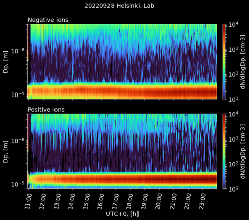

# NAIS processor
Use this code package to process [NAIS](https://www.airel.ee/products/nais/) (Neutral cluster and Air Ion Spectrometer, Airel Ltd.) data files.

The code corrects for diffusion losses in the inlet line (Gromley and Kennedy, 1948) and applies an ion mode calibration (Wagner et al. 2016). Optionally the data can be corrected to standard conditions (273.15 K, 101325 Pa), which can be useful when comparing aerosol particle and ion data from various locations at different altitudes.

Optionally one can also apply a cleaning procedure to the data where the corona ion band is removed from the particle data and instances of electrometer noise are removed from ion and particle data.

[Documentation](https://jlpl.github.io/nais-processor/)

## Installation
```
pip install nais-processor
```
## Example usage
Open the python prompt and load methods from the `nais_processor` module.
Then use the `make_config()` method to create a configuration file that
is used at processing the data files.
```
$ python
>>> from nais_processor import *
>>> make_config()

Enter name of configuration file (full path)
E.g. /home/user/campaign.yml
> /home/user/viikki.yml

Give full path(s) to raw data. If multiple paths give them as comma separated list.
E.g. /home/user/data/2021,/home/user/data/2022
> /home/user/data/2021,/home/user/data/2022

Full path to where processed data is saved.
E.g. /home/user/campaign
> /home/user/viikki

Start of measurement (YYYY-MM-DD)
Leave empty if you want to start from the earliest date found
> 2022-09-28   

End of measurement (YYYY-MM-DD)
If empty processor assumes current day, use for continuous measurements.
> 2022-09-30

Enter name of database file (full path)
E.g. /home/user/campaign.json
> /home/user/viikki.json 

Allow reprocessing (True/False)
Overwrites already processed datafiles in the database when running the processor again.
> True

Measurement location
E.g. Helsinki, Kumpula
> Viikki, Helsinki, Finland 

Apply data cleaning procedures (True/False)
Remove corona ions and electrometer noise from data
> True

Apply corrections to data? (True/False)
Requires a NAIS with temperature and pressure sensors.
> True 

Length of the inlet in meters
> 1.0 

Correct concentrations to sealevel conditions? (True/False)
> True

Configuration saved to: /home/user/viikki.yml
```
The resulting configuration file looks like this:
```yaml
allow_reprocess: true
apply_cleaning: true
apply_corrections: true
data_folder:
- /home/user/data/2021 
- /home/user/data/2022
database_file: /home/user/viikki.json
end_date: 2022-09-30
inlet_length: 1.0
location: Viikki, Helsinki, Finland
processed_folder: /home/user/viikki
sealevel_correction: true
start_date: 2022-09-28
```
Then process the data files by running `nais_processor()` method with the config file as the input argument.
```
>>> nais_processor("/home/user/viikki.yml")
Configuration file: /home/user/viikki.yml
processing 20220928
processing 20220929
processing 20220930
Done!
```
The code produces daily processed data files for ion and particle data. These files are saved in the destinations given in the configuration file.

The processed data files are named

`NAIS[n|p][yyyymmdd][np|nds].sum`

where `n` and `p` refer to negative and positive polarity respectively. `yyyymmdd` tells the date in the year-month-day format. `np` and `nds` refer to particle and ion data respectively. The cleaned files have an additional `_cleaned` at the end of the filename before the suffix.

The data files have the following structure (sum matrix)
```
[0,0]  = UTC offset in hours
[1:,0] = Time (MATLAB datenum) 
[0,2:] = Geometric mean diameter of size-channel (m)
[1:,1] = Integrated total number concentration (cm-3)
[1:,2:] = Normalized number concentrations, dN/dlogDp (cm-3)
```
The locations of raw files, processed files and cleaned processed files are written in the `database_file`, which is in JSON format.

### Combining sumfiles
Once you have processed your NAIS data you can extract any time range
in a sum matrix format using the `combine_spectra()` function.

Example:
```
import nais_processor as nais

start_time="2022-09-29 02:00:00"
end_time="2022-09-30 14:00:00"

combined_data = nais.combine_spectra(
    config_file,start_time,end_time,spectra_type="negion")
```
You can also plot sum matrices using [`plot_sumfile()`](https://jlpl.github.io/nais-processor/#nais_processor.plot_sumfile) or you can create daily plots using [`plot_nais()`](https://jlpl.github.io/nais-processor/#nais_processor.plot_nais) without playing around with sum matrices.

## License
This project is licensed under the terms of the GNU GPLv3.

## References
Gormley P. G. and Kennedy M., Diffusion from a Stream Flowing through a Cylindrical Tube, Proceedings of the Royal Irish Academy. Section A: Mathematical and Physical Sciences, 52, (1948-1950), pp. 163-169.

Wagner R., Manninen H.E., Franchin A., Lehtipalo K., Mirme S., Steiner G., Petäjä T. and Kulmala M., On the accuracy of ion measurements using a Neutral cluster and Air Ion Spectrometer, Boreal Environment Research, 21, (2016), pp. 230–241.


